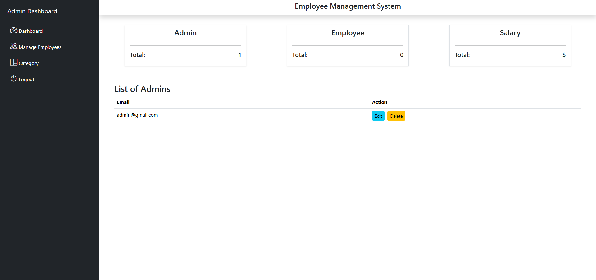
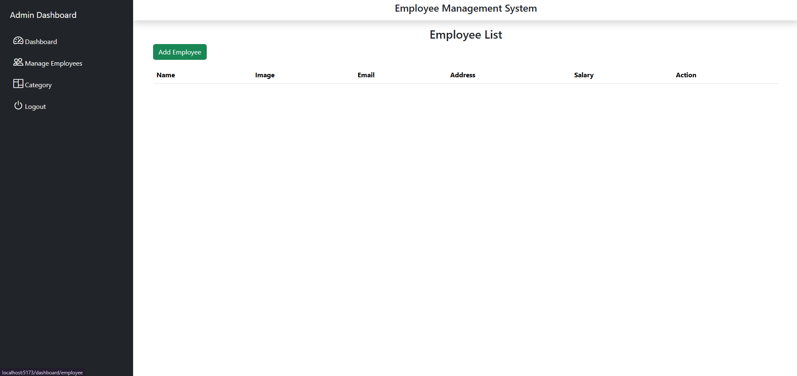

# Employee Management System (CRUD App) 🚀

This is a full-stack CRUD application for managing employees, built with:

* ⚛️ **Frontend**: React.js
* 🖥️ **Backend**: Node.js + Express
* 🛢️ **Database**: MySQL
* 🎨 **Styling**: Bootstrap
* 🔐 **Authentication**: JSON Web Tokens (JWT)
* 📁 **File Uploads**: Multer

## 🔑 Features

* 🧑‍💼 **Admin Panel**

  * 🔐 Login as Admin
  * 📊 Dashboard overview (Admin count, Employee count, Total Salary)
  * ➕➖ Add, edit, and delete employees
  * 🗂️ Create and manage categories
  * 🚪 Logout

* 👨‍🏭 **Employee Portal**

  * 🔐 Login as Employee
  * 👁️ View personal details

## 🧑‍💻 Users

There are two types of users:

* 👨‍💼 **Admin**: Has full access to the dashboard, including employee and category management.
* 👷 **Employee**: Can log in and view their own data.

## 🚀 Getting Started

### 🧰 Prerequisites

* Node.js
* npm
* XAMPP (Apache & MySQL must be running)

### 1. 📥 Clone the repository

```bash
git clone https://github.com/midjanbegic/CRUD.git
cd CRUD
```

### 2. 💻 Setup the Client

```bash
cd employeeMS
npm install
npm run dev
```

### 3. 🔧 Setup the Server

```bash
cd ../Server
npm install
npm start
```

If everything is working, you'll see:

```
Server is running
Connected
```

If there is an issue with the MySQL connection, you’ll see:

```
Server is running
connection error
```

### 4. 🛠️ Database Configuration

Make sure MySQL is running via **XAMPP**.
Import the provided SQL file (if exists) or create the database structure manually based on the project code.

> ⚠️ Note: The MySQL port in the code is set to `4306`. If you use the default port `3306`, update it in `db.js` accordingly.

---

## 📂 Project Structure

```
CRUD/
│
├── Server/              # Node.js + Express backend
│   ├── Routes/          # Route definitions
│   ├── utils/           # Database connection (db.js)
│   └── index.js         # Main server file
│
├── employeeMS/          # React frontend
│   └── src/
│       ├── pages/       # Page components
│       ├── components/  # Reusable components
│       └── App.js       # Main App component
```

## 📸 Screenshots

### Admin Dashboard


### Employee List



---

## 📜 License

This project is open-source and intended for learning purposes only. Not for commercial use.

Available under the [MIT License](LICENSE).

---

## 👤 Author

Made with ❤️ by **Midjan Begić**
